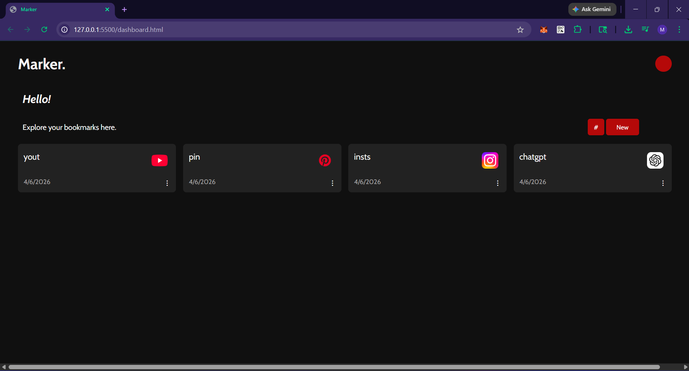

# Bookmark Saver App

A simple and responsive bookmark management web app that allows users to save, view, edit, and delete their favorite links. Built as a full-stack project to learn frontend and backend integration.

---

## Tech Stack

### Frontend

- HTML
- CSS (Flexbox & Grid for responsiveness)
- JavaScript (Vanilla JS, DOM manipulation, event delegation)

---

## Key Concepts Learned

- DOM manipulation and dynamic rendering
- Event delegation for handling dynamic elements
- LocalStorage for client-side persistence
- REST APIs using Express
- Database integration with MongoDB
- UI/UX improvements like modals and dropdown menus

---

## Future Improvements

- User authentication (login/signup)
- Deployment (Frontend and Backend)
- Categorizing bookmarks
- Favorites or pinning bookmarks
- Search and filtering

---

## Versions

### 1.0

!()

#### Features

- Bookmarks stored in localStorage
- Manual bookmark entry modal
- Delete and edit option per bookmark
- dynamic sizing of bookmark cards

## Author

Madhuparna Biswas
